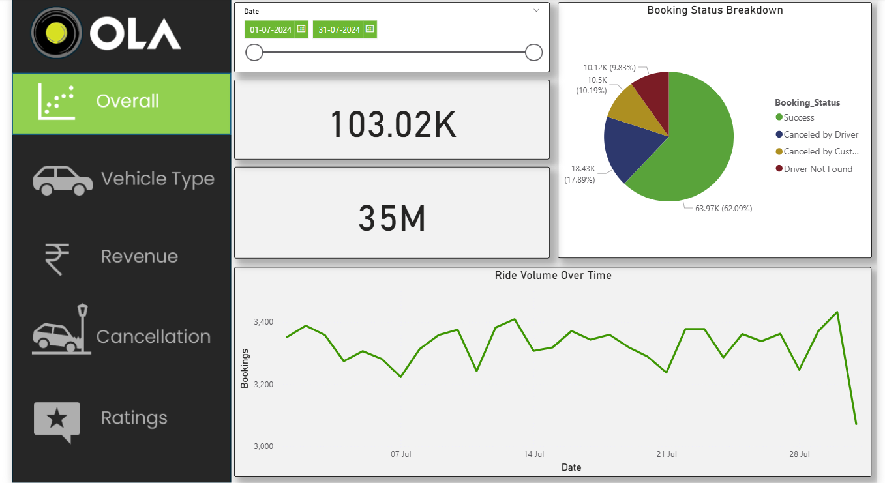

# 🚖 Ola Data Analysis Project

## 📌 Project Overview

This project focuses on analyzing Ola ride booking data to extract meaningful insights using **SQL** and **Power BI**.

The goal is to understand ride patterns, customer behavior, cancellation trends, and revenue distribution.

---

## 🎯 Objectives

* Analyze booking success and cancellation trends
* Identify top customers and vehicle performance
* Evaluate customer and driver ratings
* Understand revenue distribution across payment methods
* Build an interactive dashboard for business insights

---

## 🛠️ Tools & Technologies Used

* **SQL (MySQL)** – Data querying and analysis
* **Power BI** – Data visualization and dashboard creation
* **Excel/CSV** – Dataset storage

---

## 📂 Dataset Description

The dataset contains ride booking data with the following key columns:

* Booking ID
* Date & Time
* Booking Status
* Customer ID
* Vehicle Type
* Pickup & Drop Location
* Ride Distance
* Booking Value
* Payment Method
* Driver & Customer Ratings
* Cancellation Reasons

---

## 🔍 SQL Analysis

The following business questions were solved using SQL:

1. Retrieve all successful bookings
2. Average ride distance per vehicle type
3. Total cancelled rides by customers
4. Top 5 customers by number of bookings
5. Rides cancelled by drivers (personal/car issues)
6. Max & Min driver ratings (Prime Sedan)
7. Rides with UPI payment
8. Average customer rating per vehicle type
9. Total booking value of successful rides
10. Incomplete rides with reasons

📄 Full SQL queries available in:

```
SQL/analysis_queries.sql
```

---

## 📊 Power BI Dashboard

The interactive dashboard provides insights into:

* 📈 Ride Volume Over Time
* 📊 Booking Status Breakdown
* 🚗 Top Vehicle Types by Distance
* ⭐ Customer Ratings Analysis
* ❌ Cancellation Reasons
* 💰 Revenue by Payment Method
* 🏆 Top Customers
* 📉 Ride Distance Distribution

---

## 🖼️ Dashboard Preview

---

## 📌 Key Insights

* Majority of bookings are **successful (~60%+)**
* Customer cancellations are relatively low compared to driver cancellations
* **UPI** is one of the most preferred payment methods
* Certain vehicle types contribute more to total ride distance
* Ratings show a generally positive customer experience

---

## 🚀 How to Use

1. Clone the repository:

```
git clone https://github.com/your-username/Ola-Data-Analysis-Project.git
```

2. Open Power BI file:

```
Dashboard/Ola_Dashboard.pbix
```

3. Run SQL queries using MySQL:

```
SQL/analysis_queries.sql
```

---


## 📈 Future Improvements

* Deploy dashboard online (Power BI Service)
* Add Python-based analysis (Pandas, Matplotlib)

---

## 🙋‍♂️ Author

**Abhishek Tripathi**

* 📧 Email: [abhitripathi0419@gmail.com](mailto:abhitripathi0419@gmail.com)
* 🔗 LinkedIn: https://www.linkedin.com/in/abhishek-tripathi-431b20223

---

## ⭐ If you like this project

Give it a ⭐ on GitHub!
